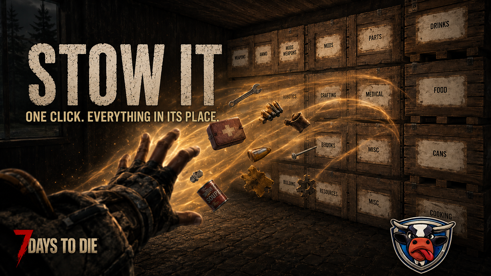

# M00 StowIt

[](https://github.com/Mad-M00/M00-StowIt/actions/workflows/build.yml)
[](https://github.com/Mad-M00/M00-StowIt/releases/latest)



**One click. Everything in its place.**

StowIt is a 7 Days To Die mod that sorts your inventory into nearby
Writable Storage Crates by category. Write a word on a crate's sign — `Ammo`,
`Medical`, `Dosen`, `弾薬` — press **LeftAlt + X**, and every item lands in
the right crate. A crate signed `Misc` catches everything else.

Inspired by [Walber-AutoSorter](https://www.nexusmods.com/7daystodie/mods/1357)
by Walber and QuickStack by Westwud.

## Features

- **Category routing** — items go to the crate whose sign matches them: by
  game group (`Medical`), item pattern (`foodCan*`), exact item name, or even
  the item's display name as you see it in-game.
- **Forgiving signs** — `Mod Tools`, `Mods \ Tools` and `MOD-TOOLS` all mean
  the same thing. Case, punctuation and plurals never matter.
- **Grows with your base** — a lone `Ammo` crate catches everything early
  game; add an `Ammo 9mm` crate later and it wins automatically. Rules higher
  in the config file beat rules below them.
- **Overflow chaining** — two crates with the same sign? The nearest fills
  first, the rest walks outward crate by crate.
- **All official game languages** — translated sign labels ship as
  `CrateLabels.<code>.txt` files (de, es, fr, it, ja, ko, pl, pt-BR, ru, tr,
  zh-CN, zh-TW). Delete a file to disable that language.
- **In-game tooling** — the `stow` console command inspects, searches, reloads
  and even *edits* your sorting rules without leaving the game.
- **Restock** — pull ammo/food back out of crates with LeftAlt + Z to top
  up what you carry. Slots locked with the game's own lock button are
  always left alone.

## Installation

1. Copy the mod folder into `...\7 Days To Die\Mods\M00-StowIt\`.
2. Start the game (EAC must allow mods; `SkipWithAntiCheat` is set).
3. In a world: place Writable Storage Crates, sign them, press LeftAlt + X.

Player guides live in [docs/user](docs/user/getting-started.md) — getting
started, sorting modes, customizing crates, and a
[FAQ](docs/user/faq.md) — all in plain language. A compact version also
ships inside the mod folder as
[`ModAssets/README.txt`](ModAssets/README.txt).

## Console commands (F1)

| Command | What it does |
|---|---|
| `stow what <label>` | Shows how a crate label resolves and every item it receives |
| `stow search <text>` | Finds items by internal or display name |
| `stow groups` | Lists all game item groups |
| `stow reload` | Reloads config and crate labels without restarting |
| `stow alias ...` | Adds, changes or deletes crate rules from in-game |

## Building from source

Requires 7 Days To Die installed (edit `GameDir` in the csproj if yours is
not in the default Steam path).

```
dotnet build M00-StowIt.csproj      # the game DLL
dotnet test                             # unit tests - no game needed
```

The mod compiles against the game's own Mono BCL (`NoStdLib` + the game's
`mscorlib.dll`) because the game's runtime includes `Span`/`ReadOnlySpan`,
which .NET Framework 4.8 reference assemblies do not.

To deploy: copy the contents of `ModAssets\` plus
`bin\Debug\net48\M00StowIt.dll` into the game's mod folder. The DLL can
only be swapped while the game is closed; label/config file changes apply
live via `stow reload`.

## For mod authors

The codebase is deliberately structured as an example of testable mod
architecture — pure logic separated from game glue, 97 unit tests that run
without the game installed, and Harmony patches kept to one-line delegations.
The documentation walks through all of it with diagrams:

- [docs/architecture.md](docs/architecture.md) — the three layers and why they exist
- [docs/sorting-pipeline.md](docs/sorting-pipeline.md) — what happens on a keypress, end to end
- [docs/label-resolution.md](docs/label-resolution.md) — how sign text becomes routing rules
- [docs/testing.md](docs/testing.md) — testing game mods without the game

## Credits

- **Westwud** — created the QuickStack mod that inspired this project
- **Walber** — created Walber-AutoSorter, another inspiration for this project
