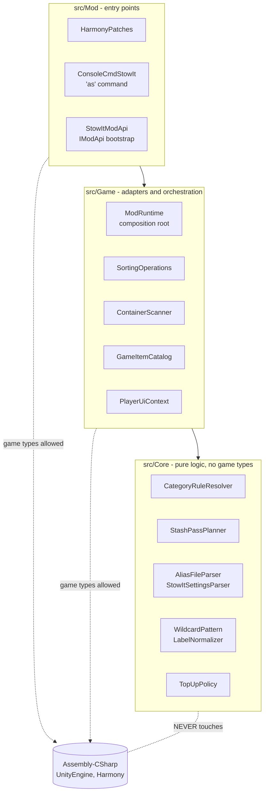
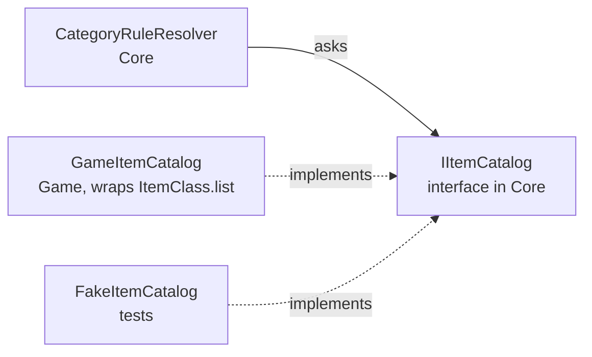
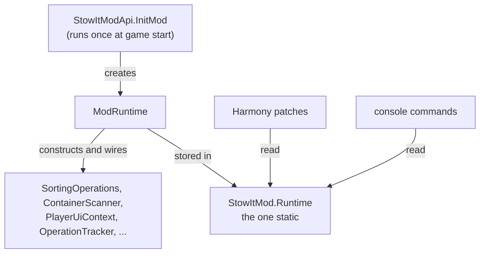

# Architecture

The mod is split into three layers with a strict dependency rule: **code may
only depend on the layer below it, and only the lower layers may touch the
game's assemblies.**



## Why bother with layers in a game mod?

Because the game is the most expensive thing to test against. Every piece of
logic that lives in `Core` can be run, debugged and regression-tested in
milliseconds with `dotnet test` — no game launch, no world load, no clicking
through inventories. Every piece that lives in `Game` or `Mod` can only be
verified by playing. So the rule is simple:

> If a piece of logic *can* be written without game types, it goes in Core.

In this mod that turned out to be almost everything interesting: the label
cascade, wildcard matching, the file formats, pass planning, priority rules,
the double-tap window, the top-up policy. What remains in `Game` is thin
glue: reading `ItemClass.list`, scanning chunks, calling `StashItems`.

## The three layers

### Core — the rules of the mod

Plain C# with zero `using` of game namespaces. Key types:

- `CategoryRuleResolver` — turns a crate label into a `CategoryRule`
  (see [label-resolution.md](label-resolution.md))
- `StashPassPlanner` — decides the order crates are filled in
  (see [sorting-pipeline.md](sorting-pipeline.md))
- `AliasFileParser` / `StowItSettingsParser` — the two config file formats
- `WildcardPattern`, `LabelNormalizer`, `SignLabelParser` — text matching
- `TopUpPolicy`, `ActionRepeatTracker` — small, single-purpose policy objects

Core never reads files and never logs directly: file contents come in as
strings, and logging goes through the tiny `ISorterLog` interface. That is
what makes it testable.

### Game — adapters over the game's API

Each class here wraps exactly one game concern:

- `GameItemCatalog` implements Core's `IItemCatalog` interface on top of
  `ItemClass.list`. Core asks "is this a known group?" or "which items match
  this pattern?" without knowing where the answers come from. In tests, a
  fake catalog answers the same questions from a hand-built item list.
- `ContainerScanner` finds eligible crates around the player (nearest first).
- `SortingOperations` orchestrates a sort: request locks, execute the pass
  plan, release locks.
- `PlayerUiContext` holds the backpack UI controllers captured by a patch.
- `ModRuntime` is the **composition root**: the one place where all of the
  above are constructed and wired together.



This is *dependency inversion*: Core defines the interface it needs; the
outer layers provide implementations. It is the single trick that lets the
resolver be tested against a five-item fake catalog instead of a running
game.

### Mod — entry points only

Harmony patches and console commands. Every patch body is a try/catch around
a one-line delegation into `Game`:

```csharp
[HarmonyPatch(typeof(LockManager), "LockResponse")]
private class LockManager_LockResponse
{
    public static void Postfix(bool _success, ..., ReadOnlySpan<ILockTarget> _targets, ...)
    {
        Runtime.Stash.HandleLockResponse(_success, _targets);
    }
}
```

If you find yourself writing logic *inside* a patch, that logic wants to
live one layer down where it can be named, reused and tested.

## The one static

Harmony patch methods must be static, so they need a static way to reach the
object graph. That is `StowItMod.Runtime` — set once in `InitMod`, read
by patches and console commands. It is the *only* mutable static in the mod;
everything behind it is instance-based and constructor-injected.



Why fight statics at all? Two reasons you will feel in practice:

1. **Reload works.** `stow reload` swaps the settings and rules by replacing
   objects behind the runtime. With scattered statics, "reload" means
   chasing every field you ever set.
2. **World changes do not leak.** When the player leaves a world, one method
   (`ModRuntime.HandleWorldUnloaded`, called from a `SaveAndCleanupWorld`
   patch) drops the UI references and the item catalog. A static-field mod
   keeps dead world objects alive in memory and reuses stale item data in
   the next world — a real bug class this codebase had before the cleanup
   hook existed.

## Lazy game data

`ItemClass.list` is empty until a world loads, so anything derived from it
(`GameItemCatalog`, `CategoryRuleResolver`) is built lazily on first use and
rebuilt after `stow reload` or a world change. Callers get `null` until the
data exists and must degrade gracefully — the console commands answer
"load into a world first", and sorting simply treats labels as unresolvable
until then.

## Files on disk

```
M00-StowIt.csproj      SDK-style project; compiles src/** into one DLL
src/Core, src/Game, src/Mod
tests/M00-StowIt.Tests xUnit project (see testing.md)
ModAssets/                 everything shipped in the mod folder:
  ModInfo.xml, StowItConfig.xml, CrateLabels.txt,
  CrateLabels.<lang>.txt x12, README.txt,
  Config/XUi_InGame/windows.xml (the two backpack buttons),
  Config/Localization.csv (button tooltips, 13 languages),
  UIAtlases/UIAtlas/*.png (button icons)
```

The mod ships as a single DLL — Core is compiled into it, not a second
assembly — so there is nothing to go wrong with load order in the game's
mod loader.
