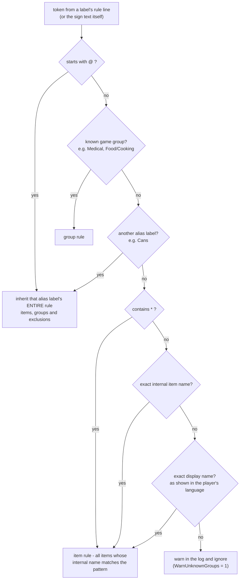
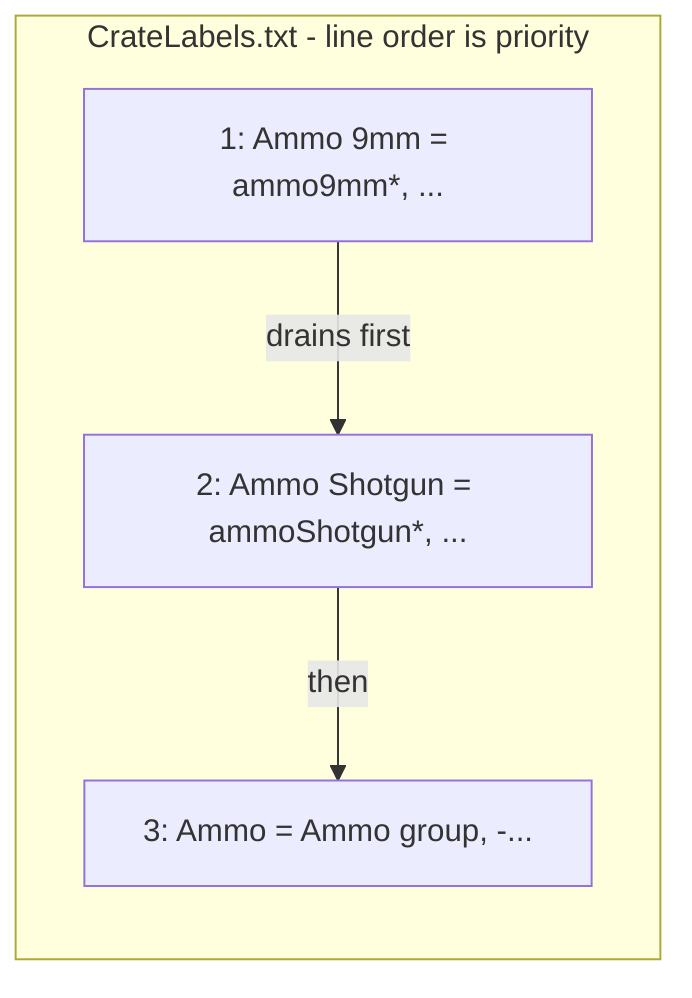

# Label resolution

The heart of the mod: turning the free text a player writes on a crate sign
into a precise routing rule. The design goal is *fuzzy in, deterministic
out* — players can be sloppy, but the same sign always resolves to the same
rule, and you can always ask the mod what it decided (`stow what <label>`).

## From sign to rule

A sign is split into labels (commas, semicolons and line breaks separate;
slashes do not, so `Building / Décor` is one label). Each label goes through
the alias table from `CrateLabels.txt` — first by exact text, then by
*normalized* text — and its tokens are resolved through a fixed cascade.
A label with no alias entry is treated as a single token and resolved the
same way, which is why a crate signed `foodCan*` works with no configuration
at all.



Order is meaning here, and two decisions deserve explanation:

- **Groups beat bare label references.** The token `Resources` in
  `Crafting = Chemicals, Resources` must keep meaning the game's Resources
  *group* even though a `Resources` crate label also exists. When you truly
  want "same as that crate", you write `@Resources`.
- **`@` beats everything.** Translations rely on it: `Dosen = @Cans` gives a
  German sign the complete Cans rule — exclusions included — so translated
  crates behave identically to the original. Circular references are
  detected and broken with a log warning instead of a stack overflow.

Any token can be prefixed with `-` to *exclude* what it matches, resolved
with the same cascade: `Cans = foodCan*, -foodCanShamSchematic` keeps the
schematic (a book) out of the cans crate.

## Fuzzy labels

Before the alias lookup gives up, the label is normalized: lowercase, all
punctuation and line breaks dropped, adjacent digit runs joined, and plain
words de-pluralized. So these all find the `Mod Tools` alias:

```
Mod Tools    Mods \ Tools    MOD-TOOLS    mod _ tools    Mod⏎Tools (two sign lines)
Ammo 7.62  ==  Ammo 762          Cans  ==  Can
```

Normalization applies to *both* sides (file labels and sign text), so it can
never mis-pair two labels that a player would consider different words.
Multi-line signs get one extra nicety: if the whole sign normalizes to a
known alias, it stays one label; otherwise line breaks split labels as they
always did, so old-style signs listing `Medical` and `Ammo` on separate
lines keep working.

## Rules, tiers and priority

A resolved `CategoryRule` holds three sets: group names, included item
names (patterns fully expanded), and excluded item names. The same rule is
consulted in two ways during sorting:

- **Item tier** — matches only the explicit item set. This is the
  high-priority tier: a crate labelled with items/patterns drains before
  any group crate.
- **Group tier** — matches by the item's game groups, minus exclusions.

Priority *within* a tier is the label's line position in `CrateLabels.txt` —
earlier lines win. That single mechanism covers the "early game one crate,
late game many" progression: define `Ammo 9mm` above `Ammo`, and the
specific crate wins the moment it exists, while the generic one keeps
catching everything that has no specific home.



## Caching and explainability

Resolution runs once per label and is cached until `stow reload` (or a world
change) rebuilds the resolver. Every resolution writes one log line saying
what the label became, and unknown tokens warn with a hint. The console can
answer the two questions players actually ask:

- `stow what Cans` — is this an alias? what did it resolve to? and the full
  list of items the crate will receive.
- `stow search sham` — what is that item actually called internally?

If you take one idea from this document: **implicit behaviour needs an
explain command.** Fuzzy matching without `stow what` would be a support
nightmare; with it, every surprise is a ten-second lookup.

## Languages

Per-language files (`CrateLabels.de.txt`, `CrateLabels.ja.txt`, ...) are
plain alias files full of `@` references, auto-discovered by filename and
loaded *before* the main file so the main file wins any label collision —
which also means a player's in-game edits (`stow alias ...`, saved to the main
file) always override a shipped translation. Item *display* names need no
translation files at all: the catalog is built from the game's localized
names, so display-name matching follows the player's language automatically.
