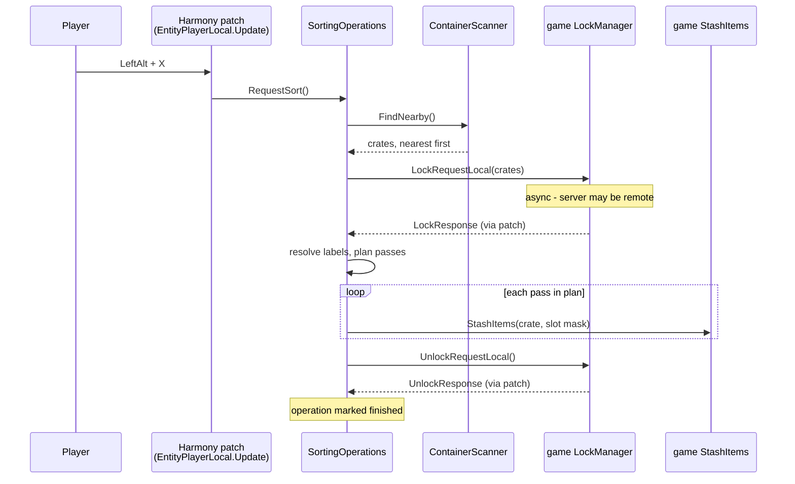
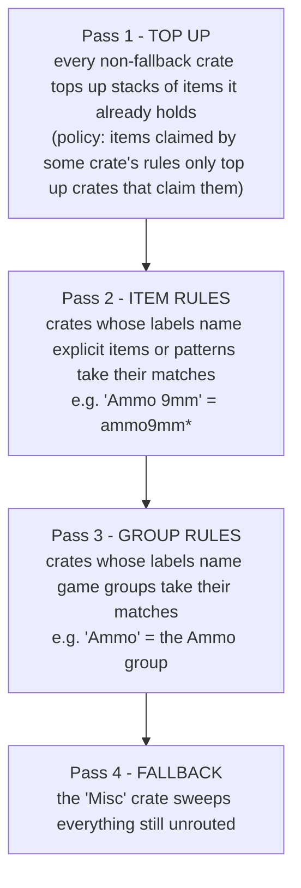

# The sorting pipeline

What actually happens between pressing LeftAlt + X and items landing in
crates. Two things make this pipeline different from a naive "loop over
containers and shove items in":

1. Container locks are **asynchronous** — the game confirms them via a
   callback, and the mod must be multiplayer-safe about it.
2. Crates are filled in a **planned order** so that specific crates always
   beat generic ones.

## End to end

The lock step matters for multiplayer: the mod never touches a container it
does not hold a lock on, so two players sorting into the same crate room
cannot duplicate or lose items. While the operation runs, an
`OperationTracker` flag suppresses the game's "container in use" popups
(two small prefix patches); the flag resets when the unlock confirms —
or in the catch block if anything throws, so a bug cannot leave the UI
permanently locked.

## Finding containers

`ContainerScanner` walks the tile-entity lists of the few chunks overlapping
the search box instead of probing every block position (the naive version
costs 3,375 world lookups at the default 15x15x15 radius; the chunk walk
costs a handful of list scans). A crate qualifies if it is touched, not
jammed, not quest loot, not locked against the player, and not open in
anyone's UI.

Results are sorted **nearest first**. That ordering is what makes overflow
predictable: two crates with the same sign fill closest-first, because each
gets its own pass and whatever did not fit in the first is still in the
backpack when the second one's turn comes.

## The pass plan

Every eligible crate's sign is read and resolved into rules (see
[label-resolution.md](label-resolution.md)). Then `StashPassPlanner` — pure
Core code — lays out the order:

Two ordering rules stack on top of the tiers:

- **Within a tier**, crates drain in *priority* order — the line order of
  their labels in `CrateLabels.txt` (earlier line wins). This is how a
  generic `Mods` crate coexists with `Mod Weapons`: both are item-tier, but
  `Mod Weapons` is defined higher in the file, so it drains first.
- **At equal priority** (typically two crates with the same sign), scan
  order applies — which is nearest-first.

The reason the tier order produces correct routing is physical: items
*actually move* each pass. By the time the group-tier `Ammo` crate gets its
turn, the 9mm rounds are already inside the `Ammo 9mm` crate and simply are
not in the backpack any more. There is no conflict-resolution logic — the
ordering *is* the conflict resolution.

## Slot masks

The game's `StashItems` accepts a "locked slots" bitmask; the mod reuses it
as a routing filter. For each pass it builds a mask where a slot is ignored
if it is player-locked, empty, or holds an item the pass's rules do not
match. Two details worth copying:

- **Identify once.** Each backpack slot's item is identified a single time
  per operation (slot contents can shrink or empty during the operation,
  but never change type — `StashItems` only removes from the backpack).
  Only the emptiness check is live per pass. This avoids re-doing thousands
  of string lookups across crates x passes.
- **Top-up policy.** Historically "the crate already holds one" beat every
  rule, so one stray bullet casing in the Ammo crate attracted casings
  forever. The `TopUpPolicy` rule: an item that some crate's rules claim
  only tops up crates that claim it; unclaimed items keep the legacy
  top-up-anywhere behaviour.

## Restock and double-tap

Restock (LeftAlt + Z) runs the same lock/unlock lifecycle in reverse,
pulling from crates into the backpack. Both sort (in Vanilla routing mode)
and restock escalate on a quick second press: first press only fills
existing stacks, a second press within two seconds also creates new stacks.
That window lives in Core (`ActionRepeatTracker`) so it is unit-tested
rather than folklore.
