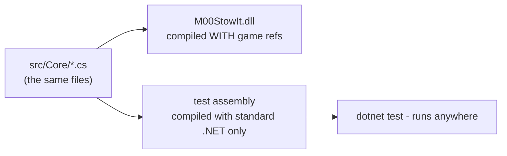

# Testing a game mod without the game

This mod has 97 unit tests that run in under a second with `dotnet test` —
no 7 Days To Die installation needed on the machine running them. This
document explains how that is possible and, more importantly, what the
tests are *for*.

## The trick: the tests compile Core's source, not the mod's DLL

You cannot load a mod DLL in a normal test runner — it references
`Assembly-CSharp` and Unity, which only exist inside the game. So the test
project does not reference the mod assembly at all. It compiles the
`src/Core` **source files** directly into itself, against standard .NET:

```xml
<!-- tests/M00-StowIt.Tests.csproj -->
<ItemGroup>
  <Compile Include="..\..\src\Core\**\*.cs" LinkBase="Core" />
</ItemGroup>
```



This gives you a second, free guarantee: **if anyone ever leaks a game type
into Core, the test project stops compiling.** The architecture rule
("Core has no game dependencies") is not a convention someone must remember
— it is enforced by the build.

Where Core needs something from the game, it asks through an interface and
the tests hand it a fake:

```csharp
// the resolver never knows which one it got
IItemCatalog real = GameItemCatalog.TryCreate(log);        // wraps ItemClass.list
IItemCatalog fake = new FakeItemCatalog(                    // five hand-made items
    new CatalogItem("foodCanBeef", "Can of Beef", "Food/Cooking"),
    new CatalogItem("foodCanShamSchematic", "Can of Sham Schematic"));
```

## What the tests protect (and what they don't)

These are **intent tests, not coverage tests**. Each one pins a decision
that, if silently changed, would re-sort a player's base or corrupt their
config. The test name states the rule; the comment states why it exists.
Examples straight from the suite:

| Test | The decision it pins |
|---|---|
| `Group_names_win_over_items_with_the_same_name` | The cascade order is a promise; a mod-added item named `medical` must not hijack every Medical crate |
| `Exclusions_remove_items_from_wildcard_matches` | `Cans = foodCan*, -foodCanShamSchematic` keeps the schematic out — the original reason exclusions exist |
| `Passes_run_most_specific_first_with_fallback_last` | Reordering the pass tiers re-routes items; the order *is* the behaviour |
| `Items_routed_only_by_another_crate_never_top_up_here` | The bullet-casing-in-the-ammo-crate regression |
| `Suffix_patterns_also_match_longer_runs_ending_the_same_way` | Documents *why* tree-seed tokens are exact names, not `treePlanted*1m` — so nobody "simplifies" the config into a bug |
| `Deleting_a_label_that_shares_a_line_keeps_its_partners` | `stow alias delete` must not take `Mod Armor` down with `Mod Armour` |
| `Malformed_xml_falls_back_to_complete_defaults` | A broken config edit can never half-apply |

Notice what is *not* tested: no test asserts that `StashItems` moves items,
that Harmony patched a method, or that chunks contain tile entities. That
is the game's behaviour and the adapter layer's job; testing it requires
the game, and pretending otherwise (mocking half the game API) produces
tests that pass while the mod is broken. The split is honest:

- **Core** — tested exhaustively, because it can be.
- **Game/Mod** — kept so thin that reading a method tells you whether it is
  right, and verified by actually playing.

## Workflow

```
dotnet test          # run everything (fast - no game needed)
dotnet build         # compile the mod DLL against the game's assemblies
```

The habit that keeps this valuable: **when a routing decision changes, the
test changes in the same commit.** A future contributor who breaks the
cascade order does not get a subtle in-game misbehaviour three weeks later —
they get a red test with a comment explaining which player-visible promise
they just broke, at compile time, before the game ever launches.

If you adopt one practice from this codebase, adopt this one. The layering
in [architecture.md](architecture.md) exists *in service of* these tests;
testability is not a by-product of the design, it is the design.
