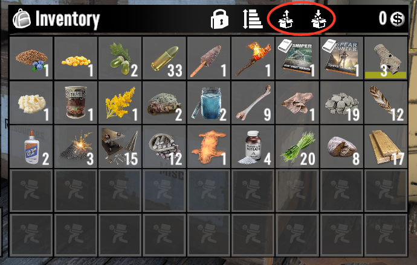

# Buttons and keys

## The buttons

Two new buttons sit above your backpack window:


*(screenshot to add: backpack UI with the sort and restock buttons circled)*

- The **sort** button empties your backpack into nearby crates.
- The **restock** button refills your carried stacks from nearby crates.

## The keys

| Keys | What happens |
|---|---|
| LeftAlt + X | Sort your backpack into nearby crates |
| LeftAlt + Z | Restock your backpack from nearby crates |

Slots you lock with the game's own lock button are always skipped.

## Changing the keys

Open `StowItConfig.xml` in Notepad. Hotkeys are key codes, one per
key, separated by spaces. The full code list is at the bottom of that
file. For example, to sort with LeftControl + S instead:

```xml
<SortButtons>306 115</SortButtons>
```

306 is LeftControl and 115 is S. Save, then press F1 in the game and
type `stow reload`.

Next: [Sorting modes](sorting-modes.md)
