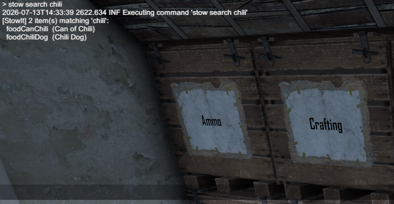
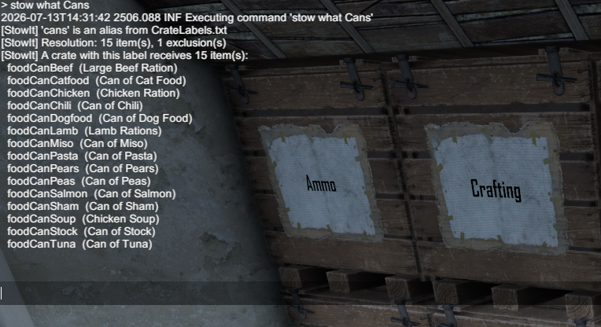

# Finding item names

Item names in the game files are things like `foodCanChili`, not
"Can of Chili". Three console commands (press F1) do the digging for
you.

## Search for an item

```
stow search chili
```

Lists every item with "chili" in its name, showing both the internal
name and the name you see in the game.


*(screenshot to add: F1 console with "stow search chili" output)*

## List the game's item groups

```
stow groups
```

Groups are the game's built-in categories, like `Medical` or
`Food/Cooking`. You can use any of them on a crate sign or in a rule.

## Check what a crate will receive

```
stow what Cans
```

Shows how the label resolves and the full list of items that crate
takes. Use it after every rule change; it answers "did I get it right?"
in one look.


*(screenshot to add: F1 console showing "stow what Cans" output)*

Next: [Items from other mods](modded-items.md)
