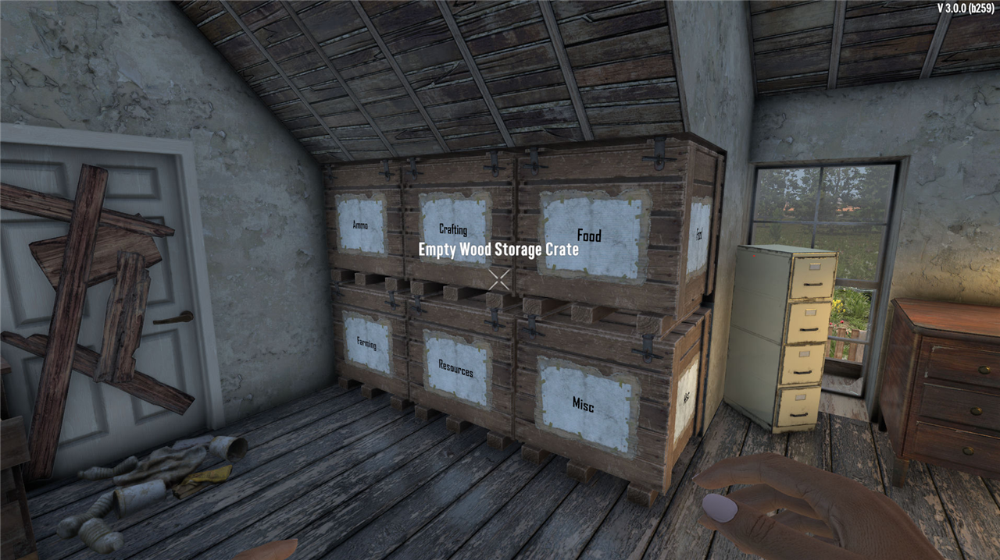

# Getting started

StowIt puts every item from your backpack into the right storage
crate with one keypress.

## What you need

- Writable Storage Crates (the ones with a sign you can write on)
- This mod installed in your Mods folder
- EAC (anti-cheat) turned off in the launcher, like for any DLL mod
- The game's own `0_TFP_Harmony` folder still in the install's Mods
  folder. It ships with the game; if it has gone missing, the
  [FAQ](faq.md#the-mod-does-not-load-and-0_tfp_harmony-is-missing)
  shows how to get it back.

## First time setup

1. Place a few Writable Storage Crates near each other.
2. Look at a crate and press E to write on its sign. Type a category
   name, for example: `Ammo`
3. Make one crate with the sign `Misc`. That one catches everything
   that has no home yet, so nothing gets lost.
4. Stand near your crates, open nothing, and press **LeftAlt + X**.

Your backpack empties and every item lands in its crate. That's the
whole mod.



## Category names that work right away

```
Drinks, Cans, Cooking, Food, Buffs, Medical, Crafting, Resources,
Farming, Building, Decor, Electrical, Ammo, Motor, Robotics, Books,
Parts, Tools, Armour, Weapons, Clothing, Mods, Mod Tools,
Mod Weapons, Mod Armor, Misc
```

You don't need to be exact. `Mod Tools`, `Mods \ Tools` and `MOD-TOOLS`
all mean the same thing to the mod.

Next: [Buttons and keys](controls.md)
