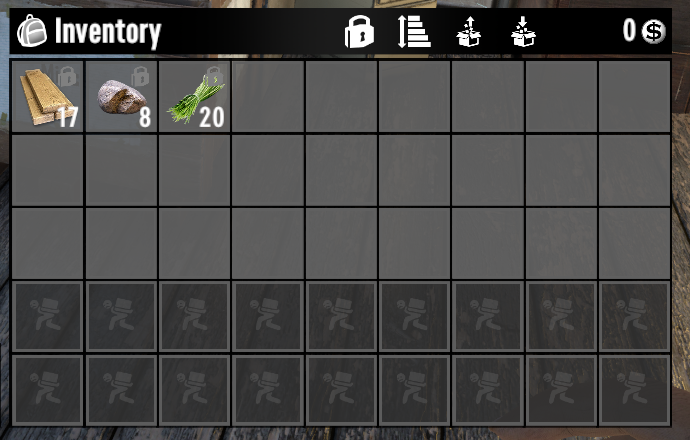

# Locked slots

The game has its own slot locking built in: the small lock button above
your backpack lets you mark slots, and the game shows a lock icon on
them.

StowIt fully respects those locks. Locked slots are never touched
by sorting or restocking, so lock the things you always want on you:
your ammo reserve, food for the road, a med kit.

That is the whole story. The mod adds nothing to locking on purpose:
locking is the game's feature, and this mod is about sorting.

*(screenshot to add: backpack with one or two vanilla-locked slots visible)*

Next: [How far it reaches](sort-distance.md)
